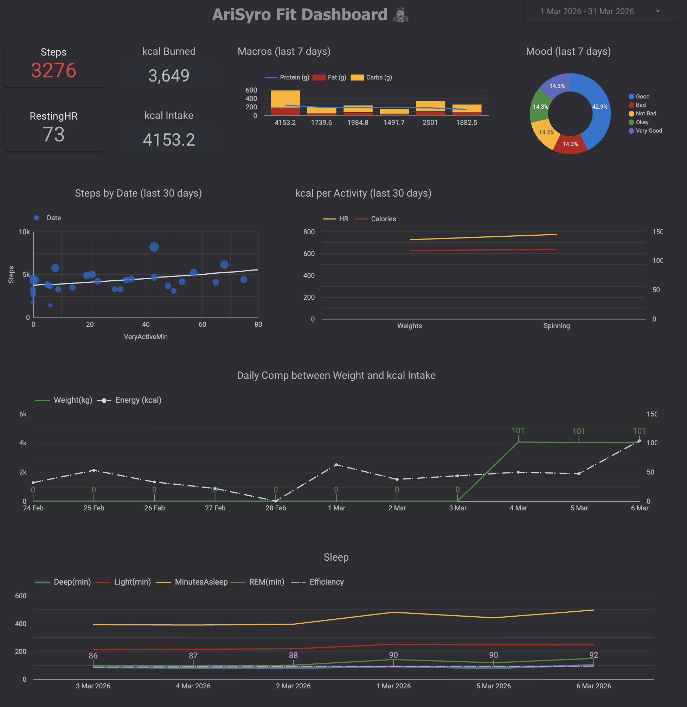

# Personal Fit/Health Analytics Dashboard

> Built because it's Fun to build your own solution, also I really needed that data
> metric views, trend analysis, or cross-data correlations needed for meaningful
> personal health/fit tracking.

**Stack:** Fitbit Web API + Cronometer CSV → Google Apps Script → Google Sheets → Looker Studio
**Cost:** 100% free
**Refresh:** Fitbit every 2 hours · Cronometer daily at 3am

---



## Background

Fitbit, in its infinite wisdom, decided the web dashboard had to go — because apparently letting users actually see their own data on a proper screen was a bit too empowering.

Things like custom metric combinations, long-term trends, activity, sleep, and heart rate, all in one place, quietly disappeared (from the web version). Because clearly the average human cannot be trusted with that level of analytical power.

So naturally, the only logical response was to rebuild the whole thing myself, adding some macro data as well from Cronometer.

This project pulls raw data from two sources into Google Sheets and pushes it to a fully custom, live dashboard in Looker Studio — restoring the extremely dangerous ability to analyse your own health metrics.

Also, I just wanted to do my own thing and build the dashboard exactly the way I wanted, adding some macro data as well, without an app deciding what I’m allowed to see.

Sometimes the best feature request is: fine, I’ll build it myself. 😄

**Data sources:**
- **Fitbit Web API** — activity, heart rate, sleep, body, exercise, intraday steps
- **Cronometer** — daily nutrition (macros, calories) via CSV export to Google Drive

Cronometer was chosen because it provides a clean daily nutrition export and is
free. Unlike MyFitnessPal (export is Premium-only) or apps with no export at all,
Cronometer lets you export a `dailysummary.csv` covering all macro and micronutrient
data. The export is web-only (not available in the Android app) — the workflow
handles this by uploading the CSV to a Google Drive folder, which Apps Script reads
automatically on a daily schedule. Currenly working a few automated solutions for direct feed through github sources but none suits me for now.

---

## Architecture

```
Fitbit Device                    Cronometer App (Android)
     │                                    │
     ▼                                    ▼
Fitbit Web API                   Cronometer Web Export
(OAuth 2.0 · REST · JSON)        (dailysummary.csv → Google Drive folder)
     │                                    │
     └──────────────┬─────────────────────┘
                    ▼
         Google Apps Script
    (scheduled · JavaScript runtime)
                    │
                    ▼
             Google Sheets
         (8 tabs · data warehouse)
                    │
                    ▼
            Looker Studio
    (connected report · custom charts · live)
```

---

## Tools & Platforms

| Tool / Platform         | Role                                                | Cost  |
|-------------------------|-----------------------------------------------------|-------|
| Fitbit Web API          | Health data (activity, HR, sleep, body, exercise)   | Free  |
| Cronometer              | Nutrition tracking app (Android + web)              | Free  |
| Google Drive            | Staging area for Cronometer CSV export              | Free  |
| Google Apps Script      | Scheduled data pipeline (JavaScript)                | Free  |
| OAuth2 Library (GAS)    | Handles Fitbit OAuth 2.0 token flow                 | Free  |
| Google Sheets           | Data storage and transformation layer               | Free  |
| Looker Studio           | Dashboard and visualisation layer                   | Free  |
| Fitbit Developer Portal | App registration and API credentials                | Free  |

---

## Google Sheet Structure

| Tab               | Source      | Data                                                       | Range   |
|-------------------|-------------|-------------------------------------------------------------|---------|
| `Activity`        | Fitbit      | Steps, calories, distance, floors, active minutes           | 30 days |
| `HeartRate`       | Fitbit      | Resting HR + min/max/avg derived from intraday 1-min data   | 30 days |
| `Sleep`           | Fitbit      | Duration, deep/light/REM/awake, score, efficiency           | 30 days |
| `Body`            | Fitbit      | Weight (kg), BMI, body fat %                                | 30 days |
| `Exercise`        | Fitbit      | Workout name, duration, calories, distance, avg HR          | Recent  |
| `Steps_Intraday`  | Fitbit      | Minute-level step counts                                    | 7 days  |
| `SpO2`            | Fitbit      | Placeholder — not available via public Web API              | —       |
| `Cronometer`      | Cronometer  | Date, Carbs (g), Fat (g), Protein (g), Energy (kcal)        | All     |
| `Mood`            | Personal Evaluation / Import | Mood of the day, Bad to Very Good          | All     |

---

## Setup Guide (the anorthodox way - my way)

### Step 1 — Create Google Sheet

1. Go to [sheets.google.com](https://sheets.google.com) → **Blank**.
2. Name it: `my data of shame`.
3. Copy the **Spreadsheet ID** from the URL:

```
https://docs.google.com/spreadsheets/d/SHEET_ID_HERE/edit
                                        ^^^^^^^^^^^^^^
```

---

### Step 2 — Create Google Drive Folder for Cronometer

1. Go to [drive.google.com](https://drive.google.com) → **New** → **Folder**.
2. Name it: `How I managed to eat so many calories`.
3. Copy the **Folder ID** from the URL:

```
https://drive.google.com/drive/folders/FOLDER_ID_HERE
                                        ^^^^^^^^^^^^^^
```

---

### Step 3 — Register Fitbit App

1. Go to [dev.fitbit.com](https://dev.fitbit.com) → **Manage** → **Register an App**.

> Do **not** use the word "Fitbit" in your app name or organisation name.
> This violates Fitbit's trademark policy, and the registration will be rejected.

| Field | Value |
|-------|-------|
| App Name | `Personal Health Dashboard` |
| Description | Personal analytics dashboard |
| Website | `https://script.google.com` |
| Organization | `Personal` |
| OAuth 2.0 App Type | **Personal** |
| Redirect URL | Placeholder — update after Step 4 |
| Category | Health & Fitness |

2. Enable scopes: `activity` `heartrate` `sleep` `profile` `weight` `social`
3. Save → copy **Client ID** and **Client Secret**.

---

### Step 4 — Create Apps Script Project

1. Go to [script.google.com](https://script.google.com) → **New project**.
2. Name it: `Health Dashboard Puller or something more fun`.
3. Add OAuth2 library:
   - Left sidebar → **Libraries** → **+**
   - Paste: `token`
   - Select latest version → **Add**.
4. Delete the default `myFunction` code.
5. Paste the full script below.
6. Set the constants at the top:

```js
var CLIENT_ID         = 'YOUR_FITBIT_CLIENT_ID';
var CLIENT_SECRET     = 'YOUR_FITBIT_CLIENT_SECRET';
var SHEET_ID          = 'YOUR_GOOGLE_SHEET_ID';
const DRIVE_FOLDER_ID = 'YOUR_DRIVE_FOLDER_ID';
```

7. Save with **Ctrl + S** (you know the drill).

---

### Step 5 — Fix Fitbit Redirect URL

1. In Apps Script, select `authorizeFitbit` from the function dropdown → **Run**.
2. Open **View → Executions** → copy the logged Authorization URL → open in browser.
3. From the browser address bar, copy everything up to `/usercallback`:

```
https://script.google.com/macros/d/{YOUR_SCRIPT_ID}/usercallback
```

4. Go to Fitbit Developer Portal → your app → **Edit** → paste this exact URL
   into the **Redirect URL** field → **Save**.

> The redirect URL must be a character-for-character match or Fitbit returns
> `invalid_request - Invalid redirect_uri parameter value`.

---

### Step 6 — Authorize Fitbit and Run

1. Run `authorizeFitbit()` → open the logged URL → click **Allow** on Fitbit.
2. Run `authorizeFitbit()` again → should log `Already authorized`.
3. Run `pullAllFitbitData()` → check your Sheet — 7 Fitbit tabs should populate.

---

### Step 7 — Export Cronometer Data

The Cronometer CSV export is only available on the **web app**, not the Android app.

**From desktop (or Chrome on Android):**

1. Go to [cronometer.com](https://cronometer.com) → log in.
2. Click **More** tab → **Your Account** → scroll to **Export Data**.
3. Choose your date range → export type: **Daily Nutrition**.
4. Download `dailysummary.csv`.
5. Upload it to your Google Drive folder (`Cronometer Exports`).

**Run the import:**

1. In Apps Script, select `importCronometerFromDrive` → **Run**.
2. Check logs → should say `✓ Done — X days written to Cronometer tab`.

---

### Step 8 — Set Up Automated Triggers

**Fitbit (every 2 hours):**

1. Apps Script → **Triggers** → **+ Add Trigger**.
2. Function: `pullAllFitbitData` · Time-driven · Hour timer · Every 2 hours.

**Cronometer (daily at 3am):**

Run `setupCronometerTrigger()` once — this sets up a daily 3am trigger automatically.
You still need to manually upload a fresh `dailysummary.csv` to Drive whenever you
want to update the nutrition data. The trigger reads whatever CSV is in the folder.

---

### Step 9 — Build Looker Studio Dashboard

1. Go to [lookerstudio.google.com](https://lookerstudio.google.com) → **Create** → **Report**.
2. **Add data** → **Google Sheets** → select `Health Dashboard`.
3. Add each tab as a separate data source.

Have Fun With It!

---

## Full Script (Code.gs)

```js
// ================================================================
// PERSONAL HEALTH ANALYTICS DASHBOARD — Google Apps Script
// Sources: Fitbit Web API + Cronometer CSV via Google Drive
// Javascript contributor Claude Code
// ================================================================

// ── Fitbit config ──────────────────────────────────────────────
var CLIENT_ID     = 'YOUR_FITBIT_CLIENT_ID';
var CLIENT_SECRET = 'YOUR_FITBIT_CLIENT_SECRET';
var SHEET_ID      = 'YOUR_GOOGLE_SHEET_ID';

// ── Cronometer config ──────────────────────────────────────────
const DRIVE_FOLDER_ID = 'YOUR_DRIVE_FOLDER_ID';
const SHEET_TAB_NAME  = 'Cronometer';

var USER_ID = '-';
var SCOPES  = 'activity heartrate sleep profile weight social';

// ─── Entry points ─────────────────────────────────────────────────────────────

function pullAllFitbitData() {
  var service = getFitbitService();
  if (!service.hasAccess()) {
    throw new Error('Not authorized. Run authorizeFitbit() first.');
  }

  var ss = SpreadsheetApp.openById(SHEET_ID);
  var opts = {
    headers: { 'Authorization': 'Bearer ' + service.getAccessToken() },
    muteHttpExceptions: true
  };

  Logger.log('Starting Fitbit data pull…');
  pullActivitySummary(ss, opts);              Utilities.sleep(1000);
  pullHeartRateSummaryWithIntraday(ss, opts); Utilities.sleep(1500);
  pullSleepSummary(ss, opts);                 Utilities.sleep(1000);
  pullBodyLogs(ss, opts);                     Utilities.sleep(1000);
  pullExerciseLogs(ss, opts);                 Utilities.sleep(1000);
  pullStepsIntraday(ss, opts);                Utilities.sleep(1000);
  createSpO2Placeholder(ss);
  Logger.log('Fitbit data updated.');
}

// ─── OAuth2 helpers ───────────────────────────────────────────────────────────

function getFitbitService() {
  return OAuth2.createService('fitbit')
    .setAuthorizationBaseUrl('https://www.fitbit.com/oauth2/authorize')
    .setTokenUrl('https://api.fitbit.com/oauth2/token')
    .setClientId(CLIENT_ID)
    .setClientSecret(CLIENT_SECRET)
    .setCallbackFunction('authCallback')
    .setPropertyStore(PropertiesService.getUserProperties())
    .setScope(SCOPES)
    .setTokenHeaders({
      Authorization: 'Basic ' +
        Utilities.base64Encode(CLIENT_ID + ':' + CLIENT_SECRET)
    });
}

function authorizeFitbit() {
  var service = getFitbitService();
  if (!service.hasAccess()) {
    Logger.log('Authorization URL: ' + service.getAuthorizationUrl());
    Logger.log('Open this URL, authorize, then run authorizeFitbit() again.');
  } else {
    Logger.log('Already authorized.');
  }
}

function authCallback(request) {
  var service = getFitbitService();
  var ok = service.handleCallback(request);
  return HtmlService.createHtmlOutput(
    ok? 'Success! Close this tab and return to Apps Script.'
       'Authorisation failed. Check redirect URL and credentials.'
  );
}

function resetAuth() {
  getFitbitService().reset();
  Logger.log('Auth reset. Run authorizeFitbit() again.');
}

// ─── Shared utilities ─────────────────────────────────────────────────────────

function safeFetch(url, options) {
  try {
    var res  = UrlFetchApp.fetch(url, options);
    var code = res.getResponseCode();
    if (code !== 200) {
      Logger.log('Non-200: ' + url + ' → ' + code + ' → ' + res.getContentText());
      return null;
    }
    return JSON.parse(res.getContentText());
  } catch (e) {
    Logger.log('Fetch failed: ' + url + ' → ' + e);
    return null;
  }
}

function formatDate_(d) {
  return Utilities.formatDate(d, 'Etc/UTC', 'yyyy-MM-dd');
}

function getDateNDaysAgo_(n) {
  var d = new Date();
  d.setDate(d.getDate() - n);
  return formatDate_(d);
}

// ─── Fitbit: Activity (30 days) ───────────────────────────────────────────────

function pullActivitySummary(ss, opts) {
  var sheet = ss.getSheetByName('Activity') || ss.insertSheet('Activity');
  sheet.clear();
  sheet.getRange(1,1,1,8).setValues([[
    'Date','Steps','Calories','Distance','Floors',
    'VeryActiveMin','FairlyActiveMin','SedentaryMin'
  ]]);

  var days = {};

  function addSeries(path, key) {
    var url  = 'https://api.fitbit.com/1/user/' + USER_ID +
               '/' + path + '/date/today/30d.json';
    var data = safeFetch(url, opts);
    if (!data) return;
    data[Object.keys(data)].forEach(function(p) {
      if (!days[p.dateTime]) days[p.dateTime] = {
        date:p.dateTime, steps:0, calories:0, distance:0,
        floors:0, veryActive:0, fairlyActive:0, sedentary:0
      };
      days[p.dateTime][key] = Number(p.value) || 0;
    });
  }

  addSeries('activities/steps',               'steps');
  addSeries('activities/calories',            'calories');
  addSeries('activities/distance',            'distance');
  addSeries('activities/floors',              'floors');
  addSeries('activities/minutesVeryActive',   'veryActive');
  addSeries('activities/minutesFairlyActive', 'fairlyActive');
  addSeries('activities/minutesSedentary',    'sedentary');

  var rows = Object.keys(days).sort().map(function(d) {
    var r = days[d];
    return [r.date,r.steps,r.calories,r.distance,r.floors,
            r.veryActive,r.fairlyActive,r.sedentary];
  });
  if (rows.length) sheet.getRange(2,1,rows.length,8).setValues(rows);
}

// ─── Fitbit: Heart Rate (resting + intraday min/max/avg) ──────────────────────

function pullHeartRateSummaryWithIntraday(ss, opts) {
  var sheet = ss.getSheetByName('HeartRate') || ss.insertSheet('HeartRate');
  sheet.clear();
  sheet.getRange(1,1,1,5).setValues([['Date','RestingHR','MinHR','MaxHR','AvgHR']]);

  var daily = safeFetch(
    'https://api.fitbit.com/1/user/' + USER_ID + '/activities/heart/date/today/30d.json',
    opts
  );
  if (!daily) return;

  var byDate = {};
  (daily['activities-heart'] || []).forEach(function(d) {
    byDate[d.dateTime] = {
      resting: (d.value || {}).restingHeartRate || null,
      min: null, max: null, sum: 0, count: 0
    };
  });

  for (var i = 0; i < 30; i++) {
    var date = getDateNDaysAgo_(i);
    var intra = safeFetch(
      'https://api.fitbit.com/1/user/' + USER_ID +
      '/activities/heart/date/' + date + '/1d/1min.json',
      opts
    );
    if (!intra) continue;

    var series = intra['activities-heart-intraday'];
    if (!series || !series.dataset) continue;

    if (!byDate[date]) byDate[date] = {
      resting:null, min:null, max:null, sum:0, count:0
    };

    series.dataset.forEach(function(p) {
      var v = Number(p.value);
      if (isNaN(v)) return;
      var day = byDate[date];
      if (day.min === null || v < day.min) day.min = v;
      if (day.max === null || v > day.max) day.max = v;
      day.sum += v;
      day.count++;
    });
    Utilities.sleep(300);
  }

  var rows = Object.keys(byDate).sort().map(function(d) {
    var day = byDate[d];
    var avg = day.count > 0 ? Math.round(day.sum / day.count) : '';
    return [d, day.resting||'', day.min||'', day.max||'', avg];
  });
  if (rows.length) sheet.getRange(2,1,rows.length,5).setValues(rows);
}

// ─── Fitbit: Sleep (30 days) ──────────────────────────────────────────────────

function pullSleepSummary(ss, opts) {
  var url  = 'https://api.fitbit.com/1.2/user/' + USER_ID +
             '/sleep/date/' + getDateNDaysAgo_(29) + '/' + formatDate_(new Date()) + '.json';
  var data = safeFetch(url, opts);
  if (!data) return;

  var sheet = ss.getSheetByName('Sleep') || ss.insertSheet('Sleep');
  sheet.clear();
  sheet.getRange(1,1,1,9).setValues([[
    'Date','Duration(ms)','Deep(min)','Light(min)','REM(min)',
    'Awake(min)','Score','Efficiency','MinutesAsleep'
  ]]);

  var rows = (data.sleep || []).map(function(n) {
    var s = n.levels && n.levels.summary ? n.levels.summary : {};
    return [
      n.dateOfSleep, n.duration||0,
      s.deep  ? s.deep.minutes  : 0,
      s.light ? s.light.minutes : 0,
      s.rem   ? s.rem.minutes   : 0,
      s.wake  ? s.wake.minutes  : 0,
      n.score||'', n.efficiency||'', n.minutesAsleep||0
    ];
  });
  if (rows.length) sheet.getRange(2,1,rows.length,9).setValues(rows);
}

// ─── Fitbit: Body / Weight (30 days) ─────────────────────────────────────────

function pullBodyLogs(ss, opts) {
  var url  = 'https://api.fitbit.com/1/user/' + USER_ID +
             '/body/log/weight/date/today/30d.json';
  var data = safeFetch(url, opts);
  if (!data) return;

  var sheet = ss.getSheetByName('Body') || ss.insertSheet('Body');
  sheet.clear();
  sheet.getRange(1,1,1,6).setValues([['Date','Weight(kg)','BMI','Fat%','LogId','Source']]);

  var rows = (data.weight || []).map(function(l) {
    return [l.date, l.weight||'', l.bmi||'', l.fat||'', l.logId||'', l.source||''];
  });
  if (rows.length) sheet.getRange(2,1,rows.length,6).setValues(rows);
}

// ─── Fitbit: Exercise Logs (last 30 days) ─────────────────────────────────────

function pullExerciseLogs(ss, opts) {
  var url  = 'https://api.fitbit.com/1/user/' + USER_ID +
             '/activities/list.json?afterDate=' + getDateNDaysAgo_(30) +
             '&sort=desc&offset=0&limit=50';
  var data = safeFetch(url, opts);
  if (!data) return;

  var sheet = ss.getSheetByName('Exercise') || ss.insertSheet('Exercise');
  sheet.clear();
  sheet.getRange(1,1,1,7).setValues([[
    'StartTime','Name','Duration(ms)','Calories','Distance','AverageHR','ActivityId'
  ]]);

  var rows = (data.activities || []).map(function(e) {
    return [
      e.startTime||'', e.activityName||e.name||'',
      e.duration||0, e.calories||0, e.distance||0,
      e.averageHeartRate||'', e.activityId||''
    ];
  });
  if (rows.length) sheet.getRange(2,1,rows.length,7).setValues(rows);
}

// ─── Fitbit: Intraday Steps (last 7 days, 1-min) ──────────────────────────────

function pullStepsIntraday(ss, opts) {
  var sheet = ss.getSheetByName('Steps_Intraday') || ss.insertSheet('Steps_Intraday');
  sheet.clear();
  sheet.getRange(1,1,1,3).setValues([['DateTime','Steps','Date']]);

  var rows = [];
  for (var i = 0; i < 7; i++) {
    var date = getDateNDaysAgo_(i);
    var data = safeFetch(
      'https://api.fitbit.com/1/user/' + USER_ID +
      '/activities/steps/date/' + date + '/1d/1min.json',
      opts
    );
    if (!data) continue;

    var series = data['activities-steps-intraday'];
    if (!series || !series.dataset) continue;

    series.dataset.forEach(function(p) {
      rows.push([date + ' ' + p.time, p.value, date]);
    });
    Utilities.sleep(300);
  }
  if (rows.length) sheet.getRange(2,1,rows.length,3).setValues(rows);
}

// ─── Fitbit: SpO2 Placeholder ─────────────────────────────────────────────────

function createSpO2Placeholder(ss) {
  var sheet = ss.getSheetByName('SpO2') || ss.insertSheet('SpO2');
  sheet.clear();
  sheet.getRange(1,1,1,3).setValues([['Date','SpO2(%)','Notes']]);
  sheet.getRange(2,1,1,3).setValues([[
    '','',
    'Not available via standard public Fitbit Web API. Requires enterprise/research export.'
  ]]);
}

// ─── Cronometer: Import from Google Drive ─────────────────────────────────────

function importCronometerFromDrive() {
  try {
    // Step 1 — Find dailysummary.csv in Drive folder
    var folder = DriveApp.getFolderById(DRIVE_FOLDER_ID);
    var files  = folder.getFilesByName('dailysummary.csv');

    if (!files.hasNext()) {
      Logger.log('No Cronometer CSV found in folder.');
      return;
    }

    var csvFile = files.next();
    Logger.log('Found file: ' + csvFile.getName());

    // Step 2 — Read and parse CSV
    // .getAs('text/plain') is required because Drive stores uploaded files
    // in a format where .getBlob().getContentAsString() does not work.
    var csvContent = csvFile.getAs('text/plain').getDataAsString();
    var rows       = Utilities.parseCsv(csvContent);

    if (rows.length < 2) {
      Logger.log('CSV is empty.');
      return;
    }

    // Step 3 — Locate required columns
    var headers    = rows;
    var dateIdx    = headers.indexOf('Date');
    var proteinIdx = headers.indexOf('Protein (g)');
    var carbsIdx   = headers.indexOf('Carbs (g)');
    var fatIdx     = headers.indexOf('Fat (g)');
    var alcoholIdx = headers.indexOf('Alcohol (g)');

    if (dateIdx === -1 || proteinIdx === -1 || carbsIdx === -1 || fatIdx === -1) {
      Logger.log('Missing required columns. Found: ' + headers.join(', '));
      return;
    }

    // Step 4 — Build clean 5-column output
    // Energy formula: (Protein × 4) + (Carbs × 4) + (Fat × 9) + (Alcohol × 7)
    var cleanRows = [['Date','Carbs (g)','Fat (g)','Protein (g)','Energy (kcal)']];

    for (var i = 1; i < rows.length; i++) {
      var protein  = parseFloat(rows[i][proteinIdx]) || 0;
      var carbs    = parseFloat(rows[i][carbsIdx])   || 0;
      var fat      = parseFloat(rows[i][fatIdx])     || 0;
      var alcohol  = alcoholIdx > -1 ? (parseFloat(rows[i][alcoholIdx]) || 0) : 0;
      var calories = (protein * 4) + (carbs * 4) + (fat * 9) + (alcohol * 7);

      cleanRows.push([
        rows[i][dateIdx],
        carbs.toFixed(1),
        fat.toFixed(1),
        protein.toFixed(1),
        calories.toFixed(1)
      ]);
    }

    // Step 5 — Write to Cronometer tab
    var ss    = SpreadsheetApp.openById(SHEET_ID);
    var sheet = ss.getSheetByName(SHEET_TAB_NAME);
    if (!sheet) {
      sheet = ss.insertSheet(SHEET_TAB_NAME);
    } else {
      sheet.clearContents();
    }

    sheet.getRange(1,1,cleanRows.length,cleanRows.length).setValues(cleanRows);
    Logger.log('✓ Done — ' + (cleanRows.length - 1) + ' days written to ' + SHEET_TAB_NAME);

  } catch (error) {
    Logger.log('Error: ' + error.toString());
  }
}

// ─── Triggers ─────────────────────────────────────────────────────────────────

// Run once to set up Cronometer daily import at 3am
function setupCronometerTrigger() {
  var triggers = ScriptApp.getProjectTriggers();
  triggers.forEach(function(t) {
    if (t.getHandlerFunction() === 'importCronometerFromDrive') {
      ScriptApp.deleteTrigger(t);
    }
  });

  ScriptApp.newTrigger('importCronometerFromDrive')
    .timeBased()
    .atHour(3)
    .everyDays(1)
    .create();

  Logger.log('✓ Daily Cronometer trigger set for 3am.');
}
```

---

## Cronometer Export Workflow

Since the Cronometer Android app does not support CSV export, the workflow is:

| Step | Action | Where |
|------|--------|-------|
| 1 | Log food as normal | Cronometer Android app |
| 2 | Open cronometer.com in browser | Desktop or Chrome on Android |
| 3 | More → Your Account → Export Data → Daily Nutrition | Cronometer web |
| 4 | Download `dailysummary.csv` | Local / Google Drive |
| 5 | Upload to `Cronometer Exports` Drive folder | Google Drive |
| 6 | `importCronometerFromDrive()` runs at 3am | Apps Script trigger |
| 7 | `Cronometer` tab updates with clean macro data | Google Sheets |

**Cronometer tab output format:**

| Date | Carbs (g) | Fat (g) | Protein (g) | Energy (kcal) |
|------|-----------|---------|-------------|---------------|
| 2026-02-23 | 210.0 | 65.0 | 140.0 | 1985.0 |
| 2026-02-24 | 195.0 | 72.0 | 135.0 | 1942.0 |

---

## API Endpoints Used

### Fitbit Web API

| Endpoint | Purpose |
|----------|---------|
| `/1/user/-/activities/{resource}/date/today/30d.json` | Activity time series |
| `/1/user/-/activities/heart/date/today/30d.json` | Daily resting HR |
| `/1/user/-/activities/heart/date/{date}/1d/1min.json` | Intraday HR (1-min) |
| `/1.2/user/-/sleep/date/{start}/{end}.json` | Sleep log date range |
| `/1/user/-/body/log/weight/date/today/30d.json` | Weight logs |
| `/1/user/-/activities/list.json` | Exercise log list |
| `/1/user/-/activities/steps/date/{date}/1d/1min.json` | Intraday steps |

**Supported activity time-series periods:** `1d` `7d` `30d` `1w` `1m`
(Note: `90d` is **not** a valid period for body/weight endpoints.)

---

## Troubleshooting

| Issue | Fix |
|-------|-----|
| `invalid_request — Invalid redirect_uri` | Redirect URL in Fitbit portal must exactly match `https://script.google.com/macros/d/{SCRIPT_ID}/usercallback` |
| `"90d" is not a supported time period` | Change to `30d` — the weight endpoint does not support `90d` |
| `Attempted to execute myFunction` | Change the run dropdown from `myFunction` to `authorizeFitbit` |
| Empty sheet tabs | Check Apps Script execution logs for `Non-200` entries |
| Token expired / revoked | Run `resetAuth()` then `authorizeFitbit()` again |
| App name rejected at Fitbit | Do not use the word "Fitbit" in app name or organisation name (trademark policy) |
| SpO₂ data missing | Not available via public Fitbit Web API |
| `csvFile.getBlob().getContentAsString is not a function` | Use `.getAs('text/plain').getDataAsString()` instead |
| `No Cronometer CSV found in folder` | Upload `dailysummary.csv` to the correct Drive folder |

---

## Limitations

- SpO₂, breathing rate, and HRV by sleep phase are not available via the
  standard public Fitbit Web API.
- Cronometer CSV export is web-only — not available in the Android app.
- Cronometer data is updated manually (upload CSV to Drive); only the
  Apps Script trigger is automated.
- Intraday HR min/max/avg is derived from 1-minute buckets, not per-second data.
- Fitbit history is limited to 30 days per run; date-range queries support
  up to 1 year if deeper history is needed.

---

## Future Improvements

- [ ] Add rolling 1-year history pull for Fitbit
- [ ] Add Active Zone Minutes endpoint
- [ ] Add device battery and last-sync status tab
- [ ] Connect SpO₂ tab via enterprise/research data export
- [ ] Automate Cronometer export via TrueNAS cron + cronometer-export CLI - Maybe


---

## References

- [Fitbit Web API Reference](https://dev.fitbit.com/build/reference/web-api/)
- [Apps Script OAuth2 Library](https://github.com/googleworkspace/apps-script-oauth2)
- [Cronometer Export Guide](https://support.cronometer.com)
- [Looker Studio Help](https://support.google.com/looker-studio)

ar1syro 2026
